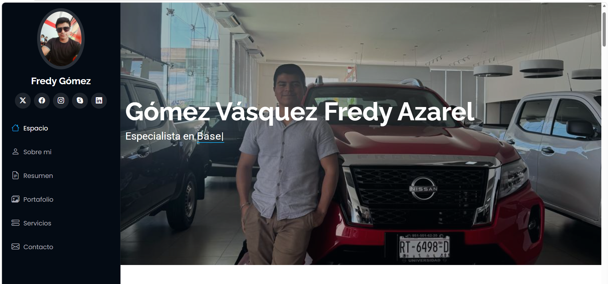
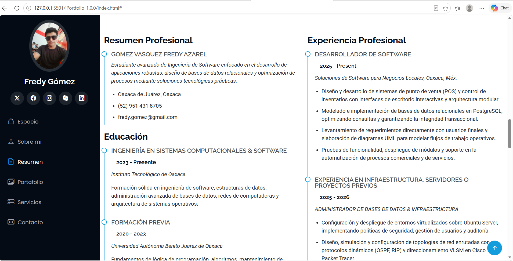
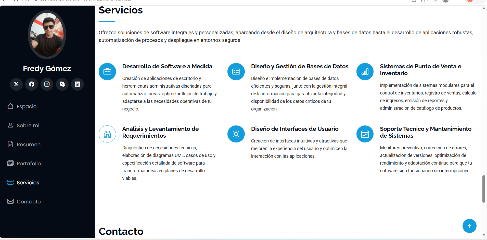

#Instituto Tecnológico de Oaxaca

##  Portafolio Web Personal

> Sitio web interactivo tipo portafolio profesional desarrollado para exhibir mi perfil técnico, proyectos de software, competencias, reconocimientos y canales de contacto.

---

##  Descripción del Proyecto

Este proyecto consiste en la adaptación, personalización y puesta en marcha de un sitio web de marca personal enfocado en **Programacion web**. Se implementó utilizando una arquitectura moderna basada en componentes responsivos para garantizar una navegación fluida tanto en dispositivos móviles como en pantallas de escritorio.

* **Framework CSS:** Bootstrap (v5.x)
* **Plantilla base:** [iPortfolio](https://bootstrapmade.com/iportfolio-bootstrap-portfolio-websites-template/) desarrollada por *BootstrapMade*.
* **Enlace de descarga de la plantilla:** [https://bootstrapmade.com/iportfolio-bootstrap-portfolio-websites-template/](https://bootstrapmade.com/iportfolio-bootstrap-portfolio-websites-template/)

### Secciones del Portafolio

1. **Espacio (Hero / Inicio):** Sección de bienvenida con fondo visual inmersivo, presentación del nombre del desarrollador y un efecto de mecanografía dinámico (*Typed.js*) que destaca los roles principales del perfil profesional.
2. **Sobre mí:** Ficha biográfica con foto de perfil, descripción profesional sintetizada, datos clave (ciudad de residencia, correo, teléfono, grado académico y disponibilidad) y resumen de objetivos técnicos.
3. **Habilidades:** Barras de progreso visuales con las principales tecnologías y herramientas dominadas (Java/JavaFX, PostgreSQL, Linux/Ubuntu Server, MongoDB, Git y Redes Cisco).
4. **Resumen :** Línea de tiempo estructurada en dos columnas que detalla el resumen del perfil, trayectoria académica universitaria en ingeniería y experiencia práctica en desarrollo de software y administración de sistemas.
5. **Portafolio (Proyectos y Certificaciones):** Galería con filtros interactivos para explorar proyectos destacados, aplicaciones de software desarrolladas y acreditaciones/certificados obtenidos.
6. **Servicios:** Cuadrícula de tarjetas con iconos representativos donde se especifican los servicios ofrecidos: desarrollo de software a medida, diseño de bases de datos, sistemas POS, análisis de requerimientos, soporte técnico y servidores.
7. **Contacto:** Datos originales para la contacto con el desarrollador

---

##  Proceso de Creación (Paso a Paso)

El desarrollo del portafolio se estructuró en las siguientes fases a partir de los archivos fuente de la plantilla:

1. **Descarga y preparación del entorno de trabajo:**
   * Se descargaron los recursos base desde el repositorio oficial de *BootstrapMade*.
   * Se organizó el árbol de directorios separando hojas de estilo (`assets/css/`), scripts de interacción (`assets/js/`), librerías de terceros (`assets/vendor/`) e imágenes (`assets/img/`).

2. **Limpieza y traducción de la estructura base (`index.html`):**
   * Se eliminaron los textos simulados en latín (*Lorem Ipsum*) distribuidos en todas las secciones.
   * Se tradujeron los títulos de navegación del menú lateral fijo del inglés al español para brindar mayor claridad a los usuarios hispanohablantes.

3. **Personalización del contenido e identidad profesional:**
   * **Sección Hero y Sobre mí:** Se sustituyó la fotografía de muestra por una fotografía personal, adaptando la bio para reflejar un enfoque directo a la ingeniería de software y desarrollo de sistemas.
   * **Skills y Porcentajes:** Se reemplazaron las métricas genéricas de diseño web (Photoshop, CMS) por tecnologías concretas de backend, bases de datos e infraestructura (Java, PostgreSQL, Linux, Git), ajustando porcentajes a niveles técnicos coherentes.
   * **Resume:** Se adaptó la cronología curricular con la formación profesional actual en el Instituto Tecnológico de Oaxaca y proyectos reales de desarrollo de software (sistemas de punto de venta e infraestructura de red).
   * **Servicios:** Se definieron 6 áreas de especialidad técnica con iconos contextuales.

4. **Integración del mapa interactivo de ubicación:**
   * Se reemplazó el `<iframe>` predeterminado de Google Maps centrado en Nueva York por las coordenadas precisas de **Oaxaca de Juárez, Oax., México**, ajustando sus parámetros para un renderizado responsivo.

5. **Pruebas y validación en navegador:**
   * Se ejecutó el proyecto en un servidor local (`Live Server`) para verificar la correcta carga de tipografías, transiciones CSS, efectos de animación (*AOS*), menú responsive colapsable y renderizado fluido en distintas resoluciones.

---

##  Capturas de Pantalla

A continuación se muestra el portafolio funcionando en el navegador web:

### 1. Sección de Inicio y Sobre mí

### 2. Habilidades Técnicas y resumen

### 3. Servicios Ofrecidos y Ubicación (Contacto)

